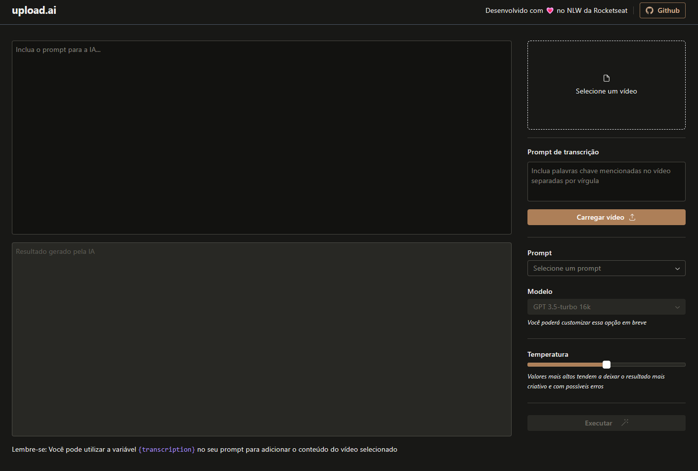

# Transcriptor

Site para gerar Transcrições/Títulos/Descrições de vídeos

## Tecnologias

- OpenAI Whisper (IA para Transcrição de Áudios)
- Cloudflare R2
- ffmpeg.wasm
- RadixUI Themes

## Instruções

- Antes de iniciar a aplicação, é necessário preencher as variáveis de ambiente. Consulte o [env de exemplo](./.env.example)

## Captura de Tela

